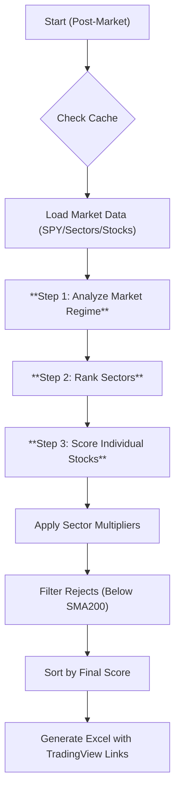

# Project Planning Document – "The Alpha Scanner"

## Table of Contents
- [Overview](#overview)
- [The Philosophy: EOD Alpha](#the-philosophy-eod-alpha)
- [Glossary of Technical Terms](#glossary-of-technical-terms)
- [Core Requirements](#core-requirements)
  - [Universe & Data Architecture](#universe--data-architecture)
  - [Level 1: Market Regime](#level-1-market-regime)
  - [Level 2: Sector Rotation](#level-2-sector-rotation)
  - [Level 3: Stock Alpha Factors](#level-3-stock-alpha-factors)
  - [The Composite Scoring Engine](#the-composite-scoring-engine)
  - [Output: The "Swing Dashboard"](#output-the-swing-dashboard)
- [Solution Architecture](#solution-architecture)
  - [Flowchart](#flowchart)
  - [Module Layout](#module-layout)
- [Implementation Roadmap](#implementation-roadmap)
- [Environment & Dependencies](#environment--dependencies)
- [Testing & Maintenance](#testing--maintenance)
- [References](#references)

---
## Overview

The Alpha Scanner v3.1 is a Position/Swing Trading decision support system.

Its primary goal is not day-trading or real-time scalping. Instead, it runs post-market (EOD) to identify high-quality assets primed for significant appreciation over a multi-week horizon. By filtering out intraday noise and focusing on structural strength, the system identifies the "easy money" moves where institutional capital is accumulating.

---
## The Philosophy: EOD Alpha

| Concept | Implementation | Why? |
|---|---|---|
| Time Horizon | Weeks to Months | We want to catch the "meat" of the move, not the wiggles. |
| Data Frequency | Daily (End-of-Day) | Real-time data is noise for swing trading. Decisions are made on closing prices. |
| Execution | Post-Market Scan | Analysis runs overnight. Orders are planned calmly for the next open. |

---
## Glossary of Technical Terms

| Term | Definition |
|---|---|
| **Market Regime** | The prevailing trend of the general market (Bull/Bear/Chop). Defined by SPY/QQQ vs SMA200. |
| **Sector RS** | The Relative Strength of an entire sector ETF (e.g., XLK, XLE) vs. the S&P 500. |
| **VCP (Volatility Contraction)** | A chart pattern where price volatility decreases (tightens) before an explosive move. |
| **Pocket Pivot** | An institutional buying footprint: Volume is higher than the highest down-volume of the last 10 days. |
| **Swing Setup** | A technical formation that suggests a price expansion in the next 3-10 days. |
| **SMA (Simple Moving Average)** | Arithmetic mean of closing prices over a specified period (e.g., 50 or 200 days). |
| **RSI (Relative Strength Index)** | Momentum oscillator measuring speed and change of price movements; ranges from 0 to 100. |
| **ATR (Average True Range)** | Volatility indicator showing the average range of price movement over a set period (commonly 14 days). |
| **Bollinger Bands** | Volatility bands placed above and below a moving average; typically ±2 standard deviations from a 20-day SMA. |

---
## Core Requirements

### Universe & Data Architecture
- **Target Universe:** S&P 500 + Nasdaq-100 (Merged & Deduplicated).
- **Benchmark & Sectors:** Must also fetch data for SPY, QQQ (Market) and Sector ETFs (XLK, XLF, XLV, XLE, XLI, XLY, XLP, XLU, XLB).
- **Pipeline (EOD Focus):**
  - **Vectorized Fetch:** `yfinance`, `threads=True`, `auto_adjust=True`.
  - **Timing:** Designed to run once daily after 4:00 PM ET.
  - **Storage:** Parquet with Atomic Writes.

### Level 1: Market Regime (The Traffic Light)
Before scoring any stock, the system evaluates the SPY:
- **Green Light:** SPY > SMA50 > SMA200. (Normal Scoring).
- **Yellow Light:** SPY < SMA50 but > SMA200. (Score Threshold increased by 10%).
- **Red Light:** SPY < SMA200. (Defense Mode: Score Threshold increased by 20%, strict stop-losses).

### Level 2: Sector Rotation
- Calculate the Relative Strength (RS) of each Sector ETF (vs SPY) over 3 months.
- **Top 3 Sectors:** Stocks in these sectors receive a Score Multiplier (1.1x).
- **Bottom 3 Sectors:** Stocks in these sectors receive a Score Penalty (0.9x).

### Level 3: Stock Alpha Factors
- **Relative Strength (RS) Rating (0-99):** Weighted 3/6/12 month performance.
- **Volatility Squeeze:** `BB_Width` at 6-month low (Energy buildup for weekly moves).
- **Trend:** Price > SMA50 > SMA200.
- **Volume:** Pocket Pivot detection.

### The Composite Scoring Engine

Final calculation for stock $i$:
$$ BaseScore_i = (RS \times 0.3) + (Squeeze \times 0.25) + (Trend \times 0.2) + (Volume \times 0.25) $$
$$ FinalScore_i = BaseScore_i \times SectorMultiplier $$

**Rejection Criteria:**
- If $Price < SMA200$: REJECT (regardless of score).
- If $Liquidity < \$20M/day$: REJECT.

### Output: The "Swing Dashboard"
- **File:** `swing_scan_[YYYY-MM-DD].xlsx`
- **Sheet 1: Top 20 Candidates**
  - **Rank:** #1 to #20 based on `FinalScore`.
  - **Context:**
    - `Market_Status`: (GREEN/YELLOW/RED)
    - `Sector_Rank`: (e.g., "Tech - #1")
  - **Action:**
    - Ticker
    - `Final_Score`
    - `Setup_Type`: (Squeeze / Trend Pullback / Power Play)
    - `Buy_Trigger`: (e.g., "Breakout above $150.20")
    - `Stop_Loss`: (SMA50 or Low of ATR)
    - `TradingView Link`: Direct URL to chart.
- **Sheet 2: Market & Sectors**
  - Summary of SPY/QQQ health.
  - Ranked list of all 11 Sectors by strength.

---
## Solution Architecture

### Flowchart

### Module Layout
- `main.py`: Orchestrator.
- `loader.py`: Enhanced to fetch Benchmarks and Sector ETFs alongside stocks.
- `market_breadth.py`: NEW. Analyzes SPY/QQQ trend and Sector rotation.
- `metrics.py`: Computes RS, VCP, etc.
- `engine.py`: Implements the `FinalScore` logic with multipliers.
- `reporter.py`: Generates the "Swing Dashboard" Excel format.
- `config.py`: Params.

---
## Implementation Roadmap

| ID | Priority | Task | Description |
|---|---|---|---|
| OT-01 | P0 | Data Loader Upgrade | Update `loader.py` to fetch SPY, QQQ, and the 9 Sector XL* ETFs. Cache them separately or in the main parquet. |
| OT-02 | P0 | Market Context Module | Create `market_breadth.py`. Implement logic to determine "Green/Red" light based on moving averages of SPY. Implement Sector Ranking logic. |
| OT-03 | P1 | Stock Scoring Core | Implement the Stock Alpha Factors in `metrics.py` (RS, VCP). |
| OT-04 | P1 | Composite Engine | Implement `engine.py` that takes the Market/Sector context and applies it to the stock scores. |
| OT-05 | P2 | Titanium Reporter | Build the Excel with "Deep Links" to TradingView and specific columns for Market Status. |
| OT-06 | - | Config & CLI | Support flags like `--defense-mode` to force strict filtering manually. |

---
## Environment & Dependencies
- **Python** ≥ 3.10; packages:
  - `pandas`
  - `numpy`
  - `yfinance`
  - `openpyxl`
  - `xlsxwriter`
  - `matplotlib`
  - `pyarrow` (for Parquet caching)
- **Runtime constraints:** API rate limits; stable internet; handle retries and back‑off.

---
## Testing & Maintenance

### Testing Strategy
- **Unit tests (Market Regime):** Test the Green/Yellow/Red light logic with synthetic SPY data.
- **Unit tests (Sector Rotation):** Verify sector ranking and multiplier application.
- **Unit tests (Scoring Engine):** Verify `FinalScore` calculation with known inputs.
- **Integration tests:** End-to-end pipeline with a small, fixed dataset of SPY, sectors, and a few stocks to ensure the final Excel output is correct.
- **Regression tests:** Pin sample datasets to detect unintended changes in output.

### Maintenance Plan
- **Constituent refresh:** Re-fetch index members weekly.
- **Config reviews:** Quarterly tuning of thresholds, weights, and sector definitions.
- **Library updates:** Monitor `yfinance`, `pandas`, etc. release notes; pin versions to avoid breaking changes.
- **Data quality monitoring:** Logs for missing data, extreme values, or failed fetches.

---
## References
- **CAN SLIM Strategy (William O'Neil):** The basis for RS and Sector emphasis.
- **Minervini VCP:** The basis for the Volatility Contraction logic.
- **yfinance documentation:** [yfinance GitHub]
- **Pandas documentation:** [Pandas Documentation]
- **XlsxWriter documentation:** [XlsxWriter Docs]